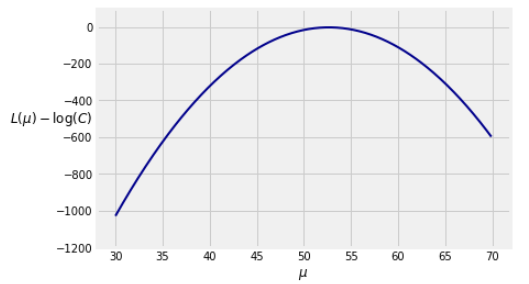

# 二十、估计方法

> 原文：[prob140/textbook/notebooks/ch20](https://nbviewer.jupyter.org/github/prob140/textbook/blob/gh-pages/notebooks/Chapter_20/)
> 
> 译者：[平淡的天](https://github.com/friedhelm739)
> 
> 协议：[CC BY-NC-SA 4.0](http://creativecommons.org/licenses/by-nc-sa/4.0/)
> 
> 自豪地采用[谷歌翻译](https://translate.google.cn/)

```python
# HIDDEN
from datascience import *
from prob140 import *
import numpy as np
import matplotlib.pyplot as plt
plt.style.use('fivethirtyeight')
%matplotlib inline
import math
from scipy import stats
```

在数据8中，我们定义了一个参数，它是一个与人口相关联的数字，或者是一个模型中的分布。在迄今为止我们所做的所有推论中，我们假设一个参数是一个固定的数字，可能是未知的。我们已经发展了估计方法，试图捕捉一个未知的固定参数在置信区间基于数据随机抽取人口。

我们将通过开发一个通用的方法来开始这一章，使我们能够得到固定参数的良好估计。本质上，它从参数的所有可能值中寻找，并选择一个使获得所观察样本的机会最大化的值。

但是还有另一种思考未知参数的方法。与其把它们想象成固定的，不如把它们想象成随机的；随机性是由于我们自己对参数的不确定度。例如，如果我们认为某类电子邮件是钓鱼邮件的几率在70%左右，那么我们可以想象这种几率本身是随机的，取自一个分布，该分布的大部分内容都在70%左右。

一旦我们收集了关于各种电子邮件消息的数据，以及它们是否是钓鱼企图，我们就可以根据这些数据更新我们的想法。我们可以将这个更新的意见表示为在收集数据之后由贝叶斯规则计算的分布。

在这一章中，我们将阐述更新我们对参数的看法的基本术语和方法。然后我们将在这两种方法的结果之间建立联系。

##最大似然估计

假设你有一簇独立同分布样本 $X_1, X_2, \ldots, X_n$ 其中每个$X_i$ 的密度取决于 $\theta$.

假设 $\theta$ 是未知常量. $\theta$ 的最大似然估计的方法是通过解答下列问题：

在参数$theta $的所有可能值中，哪一个最大化了获得样本的相似性？

最大化参数的值称为最大似然估计或简称为MLE。在本节中，我们将引出一种寻找MLE的方法。

让我们看一个例子来说明主要思想。假设您知道您的示例是从正态分布$(mu，1)$中抽取的，用于未知的$mu$，并且您正在尝试估计$mu$。假设采样值为52.8、51.1、54.2和52.5。

这是一个小样本，但它携带信息。如果你必须在32和52之间选择值$MU$，你会选择哪一个？

如果没有任何详细的计算，很明显，32不是一个好的选择——正态分布$（32，1）$不大可能产生与观察样本中值一样大的值。如果32和52是$$MU$的唯一的两个选择，那么您应该选择52。

当然，$MU$可以是任何数目。要找到最好的，你必须做一个计算。

##基于正态分布$（\MU，\σ^ 2）$样本$MU$的MLE

令$X_1, X_2, \ldots, X_n$ 为独立同分布的正态分布 $(\mu, \sigma^2)$.，样本均值是相当好的估计$MU $。在这个例子中，我们将展示它是$MU $的最大似然估计。

如果你还想估计$\sigma$呢？我们将在本节结束时解决这个问题。现在，让我们估计$MU$。

### 似然函数

似然函数是在观测值处评估的样本的联合密度，被认为是参数的函数。这有点令人困惑，但是一旦看到计算结果就变得清晰明了。这个例子中的联合密度是$n$的$(mu,sigma^2)$密度函数的乘积，因此似然函数是

$$ Lik(\mu) ~ = ~ \prod_{i=1}^n \frac{1}{\sqrt{2\pi}\sigma} \exp \big{(} -\frac{1}{2} \big{(} \frac{X_i - \mu}{\sigma} \big{)}^2 \big{)} $$

The quantity $Lik(\mu)$ is called the likelihood of the data $X_1, X_2, \ldots, X_n$ when the mean of the underlying normal distribution is $\mu$. For every fixed $\mu$, $Lik(\mu)$ is a function of the sample and hence is a random variable.

You'll soon see the reason for using the strange notation $Lik$. Please just accept it for now.

The goal is to find the value of $\mu$ that maximizes this likelihood function over all the possible values that $\mu$ could be. We don't yet know if such a maximizing value exists, but let's try to find it anyway.

To do this we will simplify the likelihood function as much as possible.

$$ Lik(\mu) ~ = ~ \big{(} \frac{1}{\sqrt{2\pi}\sigma} \big{)}^n \exp \big{(} -\frac{1}{2\sigma^2}\sum_{i=1}^n (X_i - \mu)^2 \big{)} ~ = ~ C \exp \big{(} -\frac{1}{2\sigma^2}\sum_{i=1}^n (X_i - \mu)^2 \big{)} $$

where $C$ doesn't depend on $\mu$ and thus won't affect the maximization.

Even in this simplified form, the likelihood function looks difficult to maximize. But as it is a product, we can simplify our calculations still further by taking its log.

The Log Likelihood Function
Not only does the log function turn products into sums, it is an increasing function. Hence the value of $\mu$ that maximizes the likelihood function is the same as the value of $\mu$ that maximizes the log of the likelihood function.

Let $L$ be the log of the likelihood function, also known as the log likelihood function. You can see the letter l appearing repeatedly in the terminology. Since we'll be doing most of our work with the log likelihood function, we are calling it $L$ and using $Lik$ for the likelihood function.

$$ L(\mu) ~ = ~ \log(C) - \frac{1}{2\sigma^2}\sum_{i=1}^n (X_i - \mu)^2 $$

The function $L$ looks much more friendly than $Lik$.

Because $\log(C)$ doesn't affect the maximization, we have defined a function to calculate $L - \log(C)$ for the sample 52.8, 51.1, 54.2, and 52.5 drawn from the normal $(\mu, 1)$ distribution. Remember that we began this section by comparing 32 and 52 as estimates of $\mu$, based on this sample.

In [4]:
sample = make_array(52.8, 51.1, 54.2, 52.5)
def shifted_log_lik(mu):
    return (-1/2) * sum((sample - mu)**2)
Here is a graph of the function for $\mu$ in the interval $(30, 70)$.

In [5]:
# NO CODE
mu = np.arange(30, 70, 0.1)
l = Table().with_column('Mu', mu).apply(shifted_log_lik, 0)
plt.plot(mu, l, color='darkblue', lw=2 )
plt.xlabel('$\mu$')
plt.ylabel('$L(\mu) - \log(C)$', rotation=0)
plt.ylim(-1200, 100);

The maximizing value of $\mu$ looks very close to 52.5. To find exactly where it is, we will find the derivative of $L$ with respect to $\mu$ and set that equal to 0.

Derivative of the Log Likelihood Function
Use the Chain Rule and be careful about negative signs.

$$ \frac{d}{d\mu} L(\mu) ~ = ~ \frac{2}{2\sigma^2} \sum_{i=1}^n (X_i - \mu) $$

Set Equal to 0 and Solve for the MLE
Statisticians have long used the "hat" symbol to denote estimates. So let $\hat{\mu}$ be the MLE of $\mu$. Then $\hat{\mu}$ satisfies an equation:

$$ \sum_{i=1}^n (X_i - \hat{\mu}) ~ = ~ 0 ~~~~~~ \Longleftrightarrow ~~~~~~ \sum_{i=1}^n X_i ~ = ~ n\hat{\mu} ~~~~~~ \Longleftrightarrow ~~~~~~ \hat{\mu} ~ = ~ \frac{1}{n} \sum_{i=1}^n X_i ~ = ~ \bar{X} $$

We should check that this yields a maximum and not a minimum, but given the answer you will surely accept that it's a max. You are welcome to take the second derivative of $L$ and check that we do indeed have a maximum.

We have shown that the MLE of $\mu$ is the sample mean $\bar{X}$, regardless of the population SD $\sigma$. In the case of the sample we used for the plot above, $\bar{X} = 52.65$.

In [6]:
np.mean(sample)
Out[6]:
52.650000000000006
You know that the distribution of $\bar{X}$ is normal with mean $\mu$ and variance $\sigma^2/n$. If you don't know $\sigma$, then if the sample is large you can estimate $\sigma$ by the SD of the sample and hence construct confidence intervals for $\mu$.


```python
sample = make_array(52.8, 51.1, 54.2, 52.5)
def shifted_log_lik(mu):
    return (-1/2) * sum((sample - mu)**2)
```

```python
# NO CODE
mu = np.arange(30, 70, 0.1)
l = Table().with_column('Mu', mu).apply(shifted_log_lik, 0)
plt.plot(mu, l, color='darkblue', lw=2 )
plt.xlabel('$\mu$')
plt.ylabel('$L(\mu) - \log(C)$', rotation=0)
plt.ylim(-1200, 100);
```




##找到MLE的步骤

Let's capture our sequence of steps in an algorithm to find the MLE of a parameter given an i.i.d. sample.

Write the likelihood of the sample. The goal is to find the value of the parameter that maximizes this likelihood.
To make the maximization easier, take the log of the likelihood function.
To maximize the log likelihood with respect to the parameter, take its derivative with respect to the parameter.
Set the derivative equal to 0 and solve; the sol