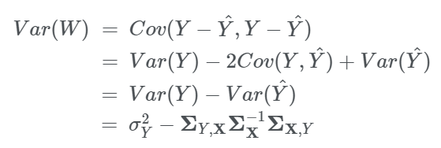
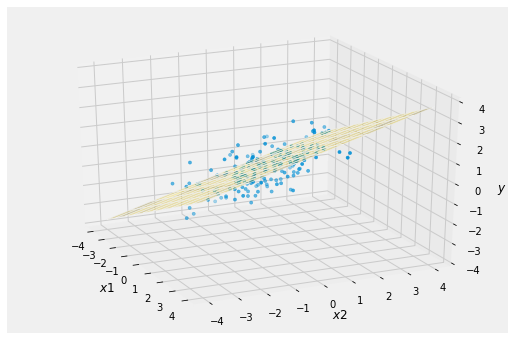
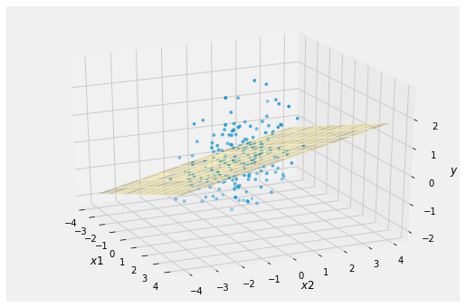
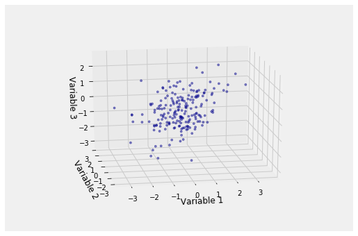

# 二十五、多元回归

> 原文：[prob140/textbook/notebooks/ch_25](https://nbviewer.jupyter.org/github/prob140/textbook/blob/gh-pages/notebooks/Chapter_25/)
> 
> 译者：[lanhaixuan](https://github.com/lanhaixuan)
> 
> 协议：[CC BY-NC-SA 4.0](http://creativecommons.org/licenses/by-nc-sa/4.0/)
> 
> 自豪地采用[谷歌翻译](https://translate.google.cn/

```python
# HIDDEN
from datascience import *
from prob140 import *
import numpy as np
import matplotlib.pyplot as plt
plt.style.use('fivethirtyeight')
%matplotlib inline
import math
from scipy import stats
from scipy import misc
```

回归的最常见用途是根据其他几个变量的值来预测数值变量的值。在我们的概率设置中,目标是预测$Y$基于$p$预测变量$X_1, X_2, \ldots, X_p$;这里$p$不是概率，而是表示预测变量数的正整数。

查找表单的最小二乘函数\
$\hat{Y} = a_1X_1 + a_2X_2 + \cdots + a_pX_p + b$被称为多元线性回归。术语“线性”是指函数在参数中是线性的$a_1, a_2, \ldots, a_p, b$。它并不是指适合的功能的形状。

例如，你可以拟合二次函数$X_1$通过采取$X_2 = X_1^2$。然后\
$\hat{Y} = a_1X_1 + a_2X_2 + b = a_1X_1 + a_2X_1^2 + b$是二次函数$X_1$。但它在系数中仍然是线性的，那些是你必须估计的。

在本章中，我们将简单回归的计算扩展到多元回归的情况。实际上，我们将利用我们关于简单回归的工作来激发对多元回归必须如何工作的猜测。然后我们将检查我们的猜测是否正确。

## 矩阵表示法中的双线性
作为回归的初步，我们将使用矩阵表示法以紧凑的形式表达双线性。本节的结果并不新鲜。它们只是使用新的符号和矩阵表示来重述关于方差和协方差的熟悉结果。

让$\mathbf{X}$为$p \times 1$预测变量的向量。我们知道这是一个$m \times p$矩阵$\mathbf{A}$和一个$m \times 1$向量$\mathbf{b}$，


以下结果是特殊情况。

###线性组合
定义两个通用的线性元素组合$\mathbf{X}$,使


然后


###两个线性组合的协方差
两个线性组合的协方差是$(1, 2)$协方差矩阵的元素$\mathbf{AX} + \mathbf{b}$,这个是$(1, 2)$的元素$\mathbf{A}\boldsymbol{\Sigma}_\mathbf{X}\mathbf{A}^T$。


###线性组合的方差
第一个线性组合的方差是$(1, 1)$的元素$\mathbf{A}\boldsymbol{\Sigma}_\mathbf{X}\mathbf{A}^T$。


###协方差向量
要预测$Y$基于$\mathbf{X}$我们需要与协方差一起工作$Y$和每个元素$\mathbf{X}$。使


并定义协方差向量 $\mathbf{X}$ 和 $Y$ 成为


协方差矢量的转置也有一个记法是很方便的：


通过协方差的线性，


## 最佳线性预测器
使 $Y$ 和 $p \times 1$ 向量 $\mathbf{X}$ 联合分发，并假设你正在试图预测 $Y$ 基于线性函数 $\mathbf{X}$。对于预测器 


预测的均方误差是


在本节中，我们将确定最小化均方误差的线性预测器。我们还将找到这个最佳预测器所产生的误差的方差。

### 线性预测器
在简单回归的情况下，我们通过使用微积分来最小化所有斜率和截距的均方误差，找到了最佳线性预测器。我们可以在这里进行该计算的多变量版本。但是由于我们在一个预测器的情况下所做的工作，我们将采取不同的方法。
 
我们将基于简单回归的答案猜测答案，然后确定我们的猜测是正确的。 
 
在简单回归的情况下，我们在表格中写了回归方程
 

 
现在定义
 

  
当
  

   
是 $p \times 1$ 线性函数系数的向量。
   
### 突出部分
注意 $E(\hat{Y}_\mathbf{b}) ~ = ~ \mu_Y$。预测器是公正的。\
定义预测中的错误
     


然后


我们现在将展示 $W$ 与所有 $\mathbf{X}$ 元素的线性组合不相关。


因为 $E(W) = 0$, 我们也有 $E(W\mathbf{a}^T\mathbf{X}) = Cov(W, \mathbf{a}^T\mathbf{X}) = 0$ 对于所有 $\mathbf{a}$ 成立。

### 最小二乘
为了展示 $\hat{Y}_\mathbf{b}$ 最小化均方误差，从练习开始：表明最佳线性预测器必须是无偏的。

完成后，您可以限制搜索所有无偏线性预测变量的最佳线性预测变量。通过定义这些通用的一个


这里 $\mathbf{h}$ 是某个 $p \times 1$ 系数向量。然后


### 回归方程和预测值
最小二乘线性预测器由下式给出


这里与 $\hat{Y}_\mathbf{b}$ 一样。我们只是为了方便而删除下标，现在我们已经确定它是最好的线性预测器。

如上所述，预测器是无偏见的：


预测值的方差是


### 误差方差
预测中的错误是 $W = Y - \hat{Y}$ 。因为 $\hat{Y}$ 是一个关于$\mathbf{X}$ 线性函数, 我么有


因此


误差的方差是



在双变量正态模型下的简单回归的情况下，我们看到误差方差为


这是我们在此建立的更通用公式的特例。不需要双变量正态假设。

与简单回归的情况一样，我们没有假设联合分布 $Y$ 和 $\mathbf{X}$ ，除了这样说 $\boldsymbol{\Sigma}_\mathbf{X}$
是肯定的。无论如何，有一个基于 $\mathbf{X}$ 的独特的最佳线性预测器 $Y$ 。


## 回归与多元正态
当 $Y$ 和 $\mathbf{X}$ 具有正定的协方差矩阵的多元正态分布，那么在前一节中导出的最佳线性预测器是所有预测器中基于 $\mathbf{X}$ 最好的 $Y$ 。这就是,


另外，条件分布 $Y$ 特定 $\mathbf{X}$ 是正常的。

这些结果是那些情况下的扩展 $Y$ 是基于一个预测因子预测 $X$。为了证明它们，你需要一些线性代数和一些耐心。我们不会在这里做证明。根据您在单个预测器的情况下所看到的情况，不应该难以相信它们是真的。

为了一些保证，我们可以模拟三变量正态分布的数据，并看看我们的条件期望公式如何与模拟点相关。

为此，我们将首先设置一些符号。我们说 $Y$ 和 $\mathbf{X}$ 具有多元正态分布，我们说 $(1+p) \times 1$ 随机向量 $[Y, X_1, X_2, \ldots, X_p]^T$ 具有二元正态分布。

为了保持变量的组织和符号的紧凑，我们将对随机向量及其均值向量进行分区。


我们也可以根据下面的分界线划分协方差矩阵。


下面的单元格生成了从多元正态分布中提取的200个点的模拟，其中提供了参数。在垂直维度上绘制的变量是 $Y$, 其他两个轴代表两个预测变量 $X_1$ 和 $X_2$。

这个平面是


请记住，它是根据此公式计算的;它没有基于200个模拟点进行估算。

请注意，所有三个变量都是标准单位，并且两个预测变量不是高度相关的：$r(X_1, X_2) = 0.2$。当然，您可以更改参数，但如果输入的“协方差矩阵”不是半正的，则会收到错误消息。

```python
mu = [0, 0, 0]
cov = np.array([[1, 0.6, 0.5],
                [0.6, 1, 0.2],
                [0.5, 0.2, 1]])
Plot_multivariate_normal_regression(mu, cov, 200)
```


这是熟悉的足球形散点图的三维版本，其中“最佳预测”线穿过它。飞机穿过云的“垂直中心”。

在下面的模拟中，这个相关性在 $Y$ 和 两个预测变量之间已经减少。注意平面的传播范围更大。

```python
mu = [0, 0, 0]
cov = np.array([[1, 0.3, 0.25],
                [0.3, 1, 0.2],
                [0.25, 0.2, 1]])
Plot_multivariate_normal_regression(mu, cov, 200)
```


本章的计算，用于预测随机变量的值 $Y$ 通过随机变量 $X_1, X_2, \ldots, X_p$的线性函数,直接应用于数据。我们看到的只是一堆观点：

```python
Scatter_multivariate_normal(mu, cov, 200)
```



但我们不知道分布的参数，因此我们无法通过散射绘制正确的平面。多元回归的问题是基于数据估计平面。

数据 - 即点云 - 包括 $n$ 个观察随机向量 $[Y, X_1, X_2, \ldots, X_p]$。那么，任务是估计平面使用 $n \times p$ 预测变量的观测值矩阵和 $n \times 1$观测值$Y$的向量。最佳平面的公式来自本章开发的随机变量的相应公式。

标准符号是使 $X$ 成为 $n \times p$ 预测矩阵，这个$j$th column $[x_{1j} ~ x_{2j} ~ \ldots ~ x_{nj}]^T$ 包含 $n$ 个第 $j$th 预测变量 $X_j$的观察值，是 $y$ 表示 $n \times 1$ 观察的$Y$向量。

我们的公式表示用于预测的最佳线性函数的系数$Y$ 基于 $\mathbf{X}$ 是整个 $p \times 1$ vector $\mathbf{b}= \boldsymbol{\Sigma}\mathbf{X}^{-1}\boldsymbol{\Sigma}{\mathbf{X}, Y}$。最佳线性函数的系数是基于整个 $p \times 1$ 向量数据 $\hat{\beta} = (X^TX)^{-1}X^Ty$。你应该能够找出原因。


