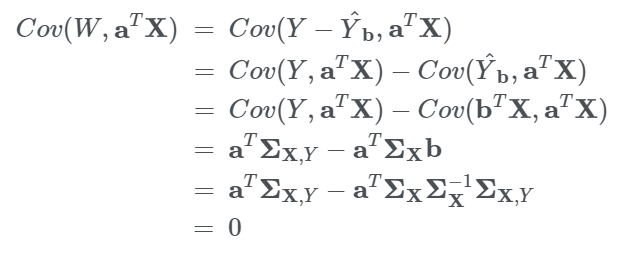
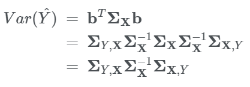

# 二十五、多元回归

> 原文：[prob140/textbook/notebooks/ch_25](https://nbviewer.jupyter.org/github/prob140/textbook/blob/gh-pages/notebooks/Chapter_25/)
> 
> 译者：[lanhaixuan](https://github.com/lanhaixuan)
> 
> 协议：[CC BY-NC-SA 4.0](http://creativecommons.org/licenses/by-nc-sa/4.0/)
> 
> 自豪地采用[谷歌翻译](https://translate.google.cn/

回归的最常见用途是根据其他几个变量的值来预测数值变量的值。在我们的概率设置中,目标是预测$Y$基于$p$预测变量$X_1, X_2, \ldots, X_p$;这里$p$不是概率，而是表示预测变量数的正整数。

查找表单的最小二乘函数\
$\hat{Y} = a_1X_1 + a_2X_2 + \cdots + a_pX_p + b$被称为多元线性回归。术语“线性”是指函数在参数中是线性的$a_1, a_2, \ldots, a_p, b$。它并不是指适合的功能的形状。

例如，你可以拟合二次函数$X_1$通过采取$X_2 = X_1^2$。然后\
$\hat{Y} = a_1X_1 + a_2X_2 + b = a_1X_1 + a_2X_1^2 + b$是二次函数$X_1$。但它在系数中仍然是线性的，那些是你必须估计的。

在本章中，我们将简单回归的计算扩展到多元回归的情况。实际上，我们将利用我们关于简单回归的工作来激发对多元回归必须如何工作的猜测。然后我们将检查我们的猜测是否正确。

## 矩阵表示法中的双线性
作为回归的初步，我们将使用矩阵表示法以紧凑的形式表达双线性。本节的结果并不新鲜。它们只是使用新的符号和矩阵表示来重述关于方差和协方差的熟悉结果。

让$\mathbf{X}$为$p \times 1$预测变量的向量。我们知道这是一个$m \times p$矩阵$\mathbf{A}$和一个$m \times 1$向量$\mathbf{b}$，

以下结果是特殊情况。

###线性组合
定义两个通用的线性元素组合$\mathbf{X}$,使

然后

###两个线性组合的协方差
两个线性组合的协方差是$(1, 2)$协方差矩阵的元素$\mathbf{AX} + \mathbf{b}$,这个是$(1, 2)$的元素$\mathbf{A}\boldsymbol{\Sigma}_\mathbf{X}\mathbf{A}^T$。

###线性组合的方差
第一个线性组合的方差是$(1, 1)$的元素$\mathbf{A}\boldsymbol{\Sigma}_\mathbf{X}\mathbf{A}^T$。

###协方差向量
要预测$Y$基于$\mathbf{X}$我们需要与协方差一起工作$Y$和每个元素$\mathbf{X}$。使

并定义协方差向量 $\mathbf{X}$ 和 $Y$ 成为

协方差矢量的转置也有一个记法是很方便的：

通过协方差的线性，

## 最佳线性预测器
使 $Y$ 和 $p \times 1$ 向量 $\mathbf{X}$ 联合分发，并假设你正在试图预测 $Y$ 基于线性函数 $\mathbf{X}$。对于预测器 

预测的均方误差是

在本节中，我们将确定最小化均方误差的线性预测器。我们还将找到这个最佳预测器所产生的误差的方差。

### 线性预测器
在简单回归的情况下，我们通过使用微积分来最小化所有斜率和截距的均方误差，找到了最佳线性预测器。我们可以在这里进行该计算的多变量版本。但是由于我们在一个预测器的情况下所做的工作，我们将采取不同的方法。
 
我们将基于简单回归的答案猜测答案，然后确定我们的猜测是正确的。 
 
在简单回归的情况下，我们在表格中写了回归方程
 

 
现在定义
 

  
当
  

   
是 $p \times 1$ 线性函数系数的向量。
   
### 突出部分
注意 $E(\hat{Y}_\mathbf{b}) ~ = ~ \mu_Y$。预测器是公正的。\
定义预测中的错误
     

然后

我们现在将展示 $W$ 与所有 $\mathbf{X}$ 元素的线性组合不相关。

因为 $E(W) = 0$, 我们也有 $E(W\mathbf{a}^T\mathbf{X}) = Cov(W, \mathbf{a}^T\mathbf{X}) = 0$ 对于所有 $\mathbf{a}$ 成立。

### 最小二乘
为了展示 $\hat{Y}_\mathbf{b}$ 最小化均方误差，从练习开始：表明最佳线性预测器必须是无偏的。

完成后，您可以限制搜索所有无偏线性预测变量的最佳线性预测变量。通过定义这些通用的一个

这里 $\mathbf{h}$ 是某个 $p \times 1$ 系数向量。然后

### 回归方程和预测值
最小二乘线性预测器由下式给出

这里与 $\hat{Y}_\mathbf{b}$ 一样。我们只是为了方便而删除下标，现在我们已经确定它是最好的线性预测器。

如上所述，预测器是无偏见的：

预测值的方差是

### 误差方差
预测中的错误是 $W = Y - \hat{Y}$ 。因为 $\hat{Y}$ 是一个关于$\mathbf{X}$ 线性函数, 我么有

因此

误差的方差是

在双变量正态模型下的简单回归的情况下，我们看到误差方差为

这是我们在此建立的更通用公式的特例。不需要双变量正态假设。

与简单回归的情况一样，我们没有假设联合分布 $Y$ 和 $\mathbf{X}$ ，除了这样说 $\boldsymbol{\Sigma}_\mathbf{X}$
是肯定的。无论如何，有一个基于 $\mathbf{X}$ 的独特的最佳线性预测器 $Y$ 。

