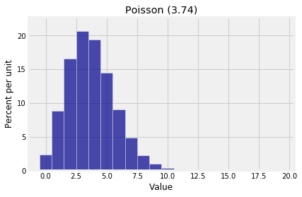
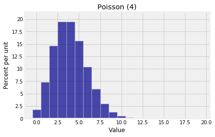
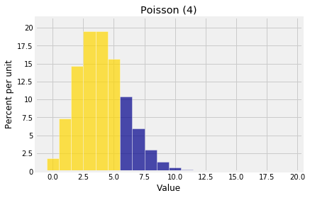

# 二十一、泊松化

> 原文：[prob140/textbook/notebooks/ch07](https://nbviewer.jupyter.org/github/prob140/textbook/tree/gh-pages/notebooks/Chapter_07/)
> 
> 译者：[YAOYI626](https://github.com/YAOYI626)
> 
> 协议：[CC BY-NC-SA 4.0](http://creativecommons.org/licenses/by-nc-sa/4.0/)
> 
> 自豪地采用[谷歌翻译](https://translate.google.cn/)

```python
# HIDDEN
from datascience import *
from prob140 import *
import numpy as np
import matplotlib.pyplot as plt
plt.style.use('fivethirtyeight')
%matplotlib inline
import math
from scipy import stats
```

二项分布$(n,p)$随机变量具有有限数量的值：它只能在0和$n$之间。 但是现在我们正在研究$n$变大时二项分布概率的行为，现在是时候从有限结果空间转向无限结果空间了。

在讨论无限多个值上的概率分布时，我们的第一个例子是来自于当$n$很大而$p$很小时我们为二项分布$(n,p)$分布找到的近似值。 在这些假设下，我们看到了$n$ i.i.d中k成功的机会。 伯努利$(p)$试验可以近似表示为
$$
P(k)~\approx~e^{-\mu} \frac{\mu^k}{k!},~~~k=0, 1, 2, \ldots, n
$$
其中 $\mu=np$。

近似式中的项与$e^\mu$的级数展开式中的项成比例，但是$e^\mu$的级数展开式有无限项。 它并不止于n，所以我们也不会。

在走得更远之前，我们需要小心一点。 首先，我们必须根据大量的可数结果来证明概率论的可加性公理：

如果事件$A_1, A_2, \ldots$是互斥的，那么
$$
P(\bigcup_{i=1}^\infty A_i) ~ = ~ \sum_{i=1}^\infty P(A_i)
$$
这被称为可数可加公理，与我们目前假设的有限加性公理形成对比。 它并非遵循有限可加性，但当然有限可加性也来自它。

在本课程中，我们不会涉及更深层次的有关可数可加性，和满足我们感兴趣的空间上的公理的概率函数存在的技术证明。 但是，在对概率理论进行更深入的理解之前，必须先研究这些技术方面。 如果你想这样做，一个好的开始是采用实分析然后测度理论。

在Prob 140中，您不必担心它。 假设我们所有的工作都与公理一致。

这是我们的第一个无限多个值的分布。


### 泊松分布

当随机变量$X$满足：
$$
P(X=k)~=~e^{-\mu} \frac{\mu^k}{k!},~~~k=0, 1, 2, \ldots
$$

这些项与 $e ^ {\mu}$ 的无限级数展开式中的项成比例。 这些项 $\frac {\mu ^ k} {k！} $ for $k \ge 0$ 确定分布的形状。
比例常数是 $e ^ { -\mu}$。它不影响形状。 它只是确保概率合为1。

$$
\sum_{k=0}^\infty P(X = k) 
~ = ~ \sum_{k=0}^\infty e^{-\mu} \frac{\mu^k}{k!} 
~ = ~ e^{-\mu} \sum_{k=0}^\infty \frac{\mu^k}{k!} 
~ = ~ e^{-\mu} \cdot e^{\mu} ~ = ~ 1
$$

泊松本来就是一种分布，它不必作为一种限制出现，虽然有时候这样想可以帮助理解。

### 对参数的解释

要理解泊松分布的参数 $\mu$ ，第一步是概率只在 $\mu$ 左右。这是 $\mu = 3.74$ 的示例。 没有计算系统可以计算无限多的概率，所以我们刚刚计算泊松概率直到总和足够接近1，即`prob140`库认为它是一个概率分布。

```python
mu = 3.74
k = range(20)
poi_probs_374 = stats.poisson.pmf(k, mu)
poi_dist_374 = Table().values(k).probability(poi_probs_374)
Plot(poi_dist_374)
plt.title('Poisson (3.74)')
```


众数为3。要找到该众数对应的公式，可以按照我们用在二项分布上的方法：计算连续比值的比，请注意它们正在减少，并查看它们交叉的位置1。这是作为练习留给您的。 您的计算应该总结如下：
**泊松分布的众数**
泊松分布的众数是 $\mu$ 的整数部分。也就是说，最可能的值是 $\mu$ 舍入到整数。如果 $\mu$ 是整数，则 $\mu$ 和 $\mu-1$ 都是众数。

```python
mu = 4
k = range(20)
poi_probs_4 = stats.poisson.pmf(k, mu)
poi_dist_4 = Table().values(k).probability(poi_probs_4)
Plot(poi_dist_4)
plt.title('Poisson (4)');
```


### 累计分布函数 (c.d.f.)

经常地，我们需要得到概率 $P(X>x)$ or $P(X \leq x)$ 。例如，如果 $X$ 服从泊松分布 Poisson $(4)$，求事件 ${X \leq 5}$ 的概率如下。
```python
Plot(poi_dist_4, event=range(6))
plt.title('Poisson (4)');
```


任意变量的累积分布函数用来计算任意点“左边的面积”。如果把累积分布函数记为 $F$ ，那么对任意x有：
$$
F(x)~=~P(X \leq x)
$$

后面的课程中我们将会对这个函数有更深的理解。但是现在，请注意 `stats`  让你可以直接计算它而不是使用 `pmf` 然后加和。这个函数叫做 `stats.distribution_name.cdf` ，其中 `distribution_name` 可以是 `binom` ， `poisson` 或者其他 `stats`能识别的分布名称。第一个参数是 $x$ ，接下来是按照特定顺序排列的其他参数。在泊松分布中，除了 $x$ 外，只有一个参数 $\mu$。

对于服从泊松分布 Poisson $(4)$ 的随机变量 $X$ ，$P(X \leq 5)$ 即为上图的黄色区域，大约为 78.5%。

```python
stats.poisson.cdf(5, 4)
```
```python
0.78513038703040516
```
为了以防万一，你把可以把各个值概率加起来来检查答案是否与你所获得的答案相同：

```python
sum(stats.poisson.pmf(np.arange(6), 4))
```
```python
0.78513038703040505
```


## 二项分布的泊松化

数据科学家最常使用的分布族是根据对数据随机性的自然假设而产生的。 这些分布族具有良好的数学特性，可以对数据问题给出有启发性的答案。 其中包括二项分布族和泊松族。

在本节中，我们将研究 Poisson 族的一些更多属性，包括它与二项分布族的另一个显著联系。

### 离散泊松变量的和

设独立随机变量$X$和$Y$分别服从泊松分布 Poisson( $\mu$ ) 和 Poisson( $\lambda$ )，那么他们的和 $S = X + Y$ 服从泊松分布 Poisson( $\mu + \lambda$ )。

为了证明这一点，首先要注意的 $S$ 的取值范围是非负整数。 对于非负整数 $s$ ，通过 $X$ 的值划分事件来找到 $P(S = s)$ ，记住X和Y都必须是非负的，因为两者服从泊松分布。

$$
\begin{align*}
P(S = s) &= \sum_{k=0}^s P(X=k, Y=s-k) \\
&= \sum_{k=0}^s e^{-\mu} \frac{\mu^k}{k!} \cdot e^{-\lambda} \frac{\lambda^{s-k}}{(s-k)!} \\
&= e^{-(\mu+\lambda)} \frac{1}{s!} \sum_{k=0}^s
\frac{s!}{k!(s-k)!} \mu^k \lambda^{s-k} \\
&= e^{-(\mu+\lambda)} \frac{(\mu+\lambda)^s}{s!}
\end{align*}
$$

通过 $(\mu + \lambda)^ s $的二项展开式。这是值为 $ s $的Poisson$(\mu + \lambda)$概率公式。

这个结果的一个重要应用是，如果$ X_1，X_2，\ldots，X_n $是独立同分布的 Poisson $(\mu)$变量，那么它们的和 $ X_1 + X_2 + \ldots + X_n $具有Poisson $(n \mu)$分布。


### 随机化伯努利试验数量
假设 $ N_H $ 是100次投掷硬币的首数，$N_T$是尾数。那么 $ N_H $和 $ N_T $远非独立。它们是彼此的线性函数，因为$ N_T = 100 - N_H $。

任何固定数量的投掷都是如此：如果你知道首数，那么你也知道尾数。

在任何固定数量的伯努利试验中，成功次数和失败次数彼此依赖。如果你知道一个，你就会知道另一个。

然而，*当试验数量本身是随机的而且服从泊松分布时*，会发生一些重要的事情。在我们看到发生了什么之后，我们将能够理解它为何重要。

设$ N $服从泊松分布Poisson $(\mu)$，设$ S $成为$ N $ i.i.d中的成功数。伯努利$(p)$试验。更正式地说：
 - 给定$ N = 0 $，将$ S $定义为0，概率为1.鉴于没有进行试验，那么就没有成功。
 - 对于$ n \ge 1 $，设 $S$ 的在 $N = n$ 的条件概率分布为二项分布 $(n, p)$ 。

然后$ N $和$ S $的联合分布律由下式给出：

$$
P(N = n，S = s)〜= ~e ^ { - \mu} \frac {\mu ^ n} {n！} \cdot
\frac {n！} {s！(n-s)！} p ^ s(1-p)^ {n-s}，~~ 0 \le s \le n
$$

$ n = 0 $时，应检查公式是否正确。

我们可以适当地求和这个联合分布中的一些项，以获得$ S $的边缘分布。

### 一个成功的泊松数
$ S $的取值范围是$ 0,1,2，\ldots $没有上限，因为$ N $的取值范围没有上限。对于$ s \ge 0 $，

$$
\begin{align*}
#P(S = s)＆= \sum_ {n = s} ^ \infty P(N = n，S = s)\\\\
＆= \sum_ {n = s} ^ \infty e ^ { - \mu} \frac {\mu ^ n} {n！} \cdot
\frac {n！} {s！(n-s)！} p ^ sq ^ {n-s} ~~~~ \text {where} q = 1-p \\\\
＆= e ^ { - \mu} \frac {\mu ^ sp ^ s} {s！} \sum_ {n = s} ^ \infty
\frac {\mu ^ {n-s} q ^ {n-s}} {(n-s)！} \\\\
＆= e ^ { - \mu} \frac {(\mu p)^ s} {s！} \sum_ {n = s} ^ \infty
\frac {(\mu q)^ {n-s}} {(n-s)！} \\\\
＆= e ^ { - \mu} \frac {(\mu p)^ s} {s！} \sum_ {j = 0} ^ \infty
\frac {(\mu q)^ j} {j！} \\\\
＆= e ^ { - \mu} \frac {(\mu p)^ s} {s！} e ^ {\mu q} \\\\
＆= e ^ { - \mu p} \frac {(\mu p)^ s} {s！} ~~ \text {because} \mu p + \mu q = \mu
\end{align*}
$$

因此$ S $的分布是泊松参数$ \mu p $。

注意我们刚刚证明了什么。如果试验数$ n $是固定的，你知道成功数量的分布是二项分布$(n，p)$。但如果试验次数是随机的Poisson $(\mu)$分布，那么成功次数的分布是泊松$(\mu p)$。这是*泊松化*二项分布中的一个重要步骤。

最棒的地方还没到，但让我们花一点时间以数字方式查看结果。假设你进行一个泊松分布 Poisson (12)的独立同分布的伯努利(1/3)试验。然后试验的次数最有可能在12左右，但你不能确切地说它会是什么，因为它是随机的。我们所展示的是成功的数量是泊松参数 12 \times \frac {1} {3} = 4 。

参数4不易直观理解。你最有可能看到大约12次试验，其中约1/3会成功，所以你最有可能看到4次成功。

### 成功和失败是独立的
 是的，你没有看错。如果你运行泊松数为独立同分布的的伯努利试验，那么成功的数量和失败的数量*独立*。

随机化参数(在这种情况下是试验次数)会对随机变量之间的关系产生巨大影响。

让我们证明一下这个结果，然后我们看一下它的使用方式。

假设我们之前正在运行 $N$  独立同分布的伯努利(p)试验，其中 $N$ 服从泊松分布 Poisson (\mu)。和以前一样，设 S 成为成功的数量。

现设 F 为失败次数。
那么 F 服从泊松分布 Poisson (\mu q)，其中 q = 1-p 。接下来是在我们之前的论证中将“成功”重新定义为“失败”。

 S 和 F 的联合分布是

$$
\begin{align*}
#P(S = s，F = f)＆= P(N = s + f，S = s)\\\\
＆= e ^ { - \mu} \frac {\mu ^ {s + f}} {(s + f)！} \frac {(s + f)！} {s！f！} p ^ sq ^ F \\\\
＆= \big {(} e ^ { - \mu p} \frac {(\mu p)^ s} {s！} \big {)}
\big {(} e ^ { - \mu q} \frac {(\mu q)^ f} {f！} \big {)} \\\\
＆= P(S = s)P(F = f)
\end{align*}
$$

这表明 S 和 F 是独立的。

### 总结：二项分布的泊松化
假设你进行$ N $ 次独立同分布的的伯努利$(p)$试验，其中$ N $服从泊松分布 Poisson $(\mu)$分布。设$ S $为成功次数，$ F $为失败次数，设$ q = 1-p $。那么：
 - $ S $服从泊松分布 Poisson $(\mu p)$。
 - $ F $服从泊松分布 Poisson $(\mu q)$。
 - $ S $和$ F $是独立的。

例如，假设人口中90％的人属于A类，10％属于B类。假设你选择 N 人的样本，以便 N 服从泊松分布Poisson (20)和选择是独立同分布的，然后在您的样本中，A类人数服从泊松分布 Poisson (18)，B类中的数字服从泊松分布 Poisson (2)，并且两个类别中的计数是独立的。

例如，每个类在样本中出现至少五次的机会是

$$
\big {(} \sum_ {i = 5} ^ \infty e ^ { - {18}} \frac {18 ^ i} {i！} \big {)}
\big {(} \sum_ {j = 5} ^ \infty e ^ { - {2}} \frac {2 ^ j} {j！} \big {)}
~=~
\big {(} 1 - \sum_ {i = 0} ^ 4 e ^ { - {18}} \frac {18 ^ i} {i！} \big {)}
\big {(} 1- \sum_ {j = 0} ^ 4 e ^ { - {2}} \frac {2 ^ j} {j！} \big {)}
$$

大约是5％。

```python
(1 - stats.poisson.cdf(4, 18))*(1 - stats.poisson.cdf(4, 2))
```
```python
0.052648585218160585
```

当分为两类时，泊松化已经非常了不起了，当有三个或更多类时，泊松化更加有助于简化计算，这一点我们将在下一节中看到。

## 多项式的泊松化
```python
# HIDDEN
from datascience import *
from prob140 import *
import numpy as np
import matplotlib.pyplot as plt
plt.style.use('fivethirtyeight')
%matplotlib inline
import math
from scipy import stats
```
Bernoulli 试验有两种出现方式。但是其它许多试验以多种不同的方式出现，我们可能想要跟踪这些方式。骰子可以以六种不同的方式着陆。评委会成员可以拥有几种不同的教育水平之一。通常，个人可能属于几个类别之一。
*多项分布*是二项分布的扩展，以及每次重复试验有两种以上可能结果的情况。我们先在一个例子中看一下它，然后我们将一般地定义它。

一个盒子里有2张蓝色票，5张绿色票和3张红色票。从中随机有放回地抽取十五次。为了找到画出4张蓝色，9张绿色和2张红色票的机会，我们可以先编写4个B，9个G和2个R出现的所有排序方式。

每个这样的排序方式出现的概率都是 $0.2 ^ 4 0.5 ^ 9 0.3 ^ 2$，所以我们只需要计算出所有的排序方式的总数就可以得到事件概率。
 - 有 $\binom {15} {4}$ 选择写B的地方。
 - 对于这些方法中的每一种，都有 $\binom {11} {9}$ 方式来选择其余11个位置中的9个来写G。
 - 剩下的2个地方写R。

所以

$$
\begin {align *}
P(\text {4 blue，9 green，2 red})
＆= \binom {15} {4} \cdot \binom {11} {9} 0.2 ^ 4 0.5 ^ 9 0.3 ^ 2 \\\\
＆= \frac {15！} {4！11！} \cdot \frac {11！} {9！2！} 0.2 ^ 4 0.5 ^ 9 0.3 ^ 2 \\\\
＆= \frac {15！} {4！9！2！} 0.2 ^ 4 0.5 ^ 9 0.3 ^ 2
\end {align *}
$$

注意这是如何通过引入第三类来简单地扩展二项分布概率公式。

类似地，或通过归纳正式，您可以将公式扩展到任何有限数量的类别或类别。

### 多项分布
$n$ 为某个确定的正整数。假设我们正在进行 $n$个独立同分布的实验，每个试验的结果都是 $k$ 类之一。对于每个 $i = 1,2，\ldots，k$，让单次实验获得 Class $ i$ 的概率为$p_i$ ，那么 $\sum_ {i = 1} ^ k p_i = 1$。

对于每个 $i = 1,2，\ldots，k$，设 $N_i$ 为结果为 $i$ 的试验次数，那么$\sum_ {i = 1} ^ k N_i = n$ 。

然后 $N_1，N_2，\ldots，N_k$ 的* 联合*概率分布是
由下式给出：

$$
P(N_1 = n_1，N_2 = n_2，\ldots，N_k = n_k)
~=~\frac {n！} {n_1！n_2！ \ldots n_k！} p_1 ^ {n_1} p_2 ^ {n_2} \cdots p_k ^ {n_k}
$$

其中对  $1 \le i \le k$ 有 $n_i \ge 0$，$\sum_ {i = 1} ^ k n_i = n$ 。

当只有两个类时，则 $k = 2$ ，公式简化为熟悉的二项分布公式，写成成功次数和失败次数的联合分布如下：

$$
P(N_1 = n_1，N_2 = n_2)= \frac {n！} {n_1！n_2！} p_1 ^ {n_1} p_2 ^ {n_2} ~~ \text {where} p_1 + p_2 = 1 \text {和}
n_1 + n_2 = n
$$

### 二项边际分布
无论有多少类，每个 $N_i$ 的边际分布都是二项分布 ，$(n，p_i)$。你不必对联和密度函数求和就可以解决这个问题。 $N_i$ 是实验结果为 i 的数量；每次实验的结果为 $i$ 的概率为 $p_i$ ;共有 $n$ 次实验。这就是其二项分布的参数设置。

### 泊松化
如果用服从泊松分布 Poisson$ (\mu)$ 随机数量的试验替换固定数量 $n$ 的试验，那么多项分布得到的泊松化化如下：
- 对于每个 $i = 1,2，\ldots，k$，$N_i$ 服从泊松分布 Poisson $(\mu p_i)$。
- $k$ 类结果出现的次数 $N_1，N_2，\ldots，N_k$ 是相互独立的。

因为之前已经给出了 $k = 2$ 时的证明，我们不再扩展我们的证明。但是，我们将研究结果为何重要。

当试验次数固定时，$N_1，N_2，\ldots，N_k$ 都以复杂的方式相互依赖。但是，当你将试验次数设为泊松随机变量时，计数 $N_1，N_2，\ldots，N_k$ 的独立性可以让你快速计算样本中任何指定类别的概率。

例如，假设在你假设的人口中，分类如下：
 - 1级：20％
 - 2级：30％
 - 3级：50％

现在假设您进行 $N$ 次独立实验，其中 $N$ 服从泊松分布 Poisson $(20)$ 分布，那么每个类中至少有3次获得的机会约为71.27％。

```python
(1 - stats.poisson.cdf(2,4))*(1-stats.poisson.cdf(2,6))*(1-stats.poisson.cdf(2,10))
```
```python
0.71270362753222372
```

答案的因数数量等于类的数量，这与容斥公式中每增加一个类，工作量就会增加很多不同，正如你在练习中看到的那样。

这有助于数据科学家处理诸如“我必须抽样多少次以便我看到每个类中至少有一次超过给定阈值的概率？”这样的问题。当然，答案取决于群体中类的分布，但允许试验次数为泊松随机变量可以使计算更容易处理。对于应用程序，请参阅
示例摘要和参考文献[论文](http://people.csail.mit.edu/jayadev/papers/psn_unv_cmp.pdf)。**注意。**如果有大量的类别，那么即使具有固定但较大的样本容量，不同类别中的样本计数也几乎是独立的。 如果您知道某些计数，但是该信息对其他计数的分布没有太大影响。 在这种情况下，即使样本大小是固定的，如果将计数视为独立变量，也不会出错。
